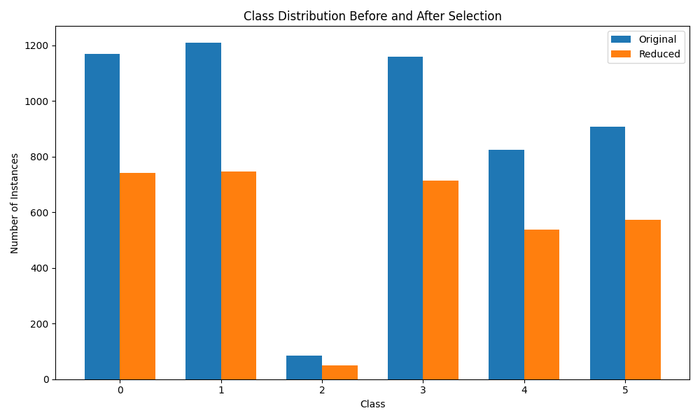
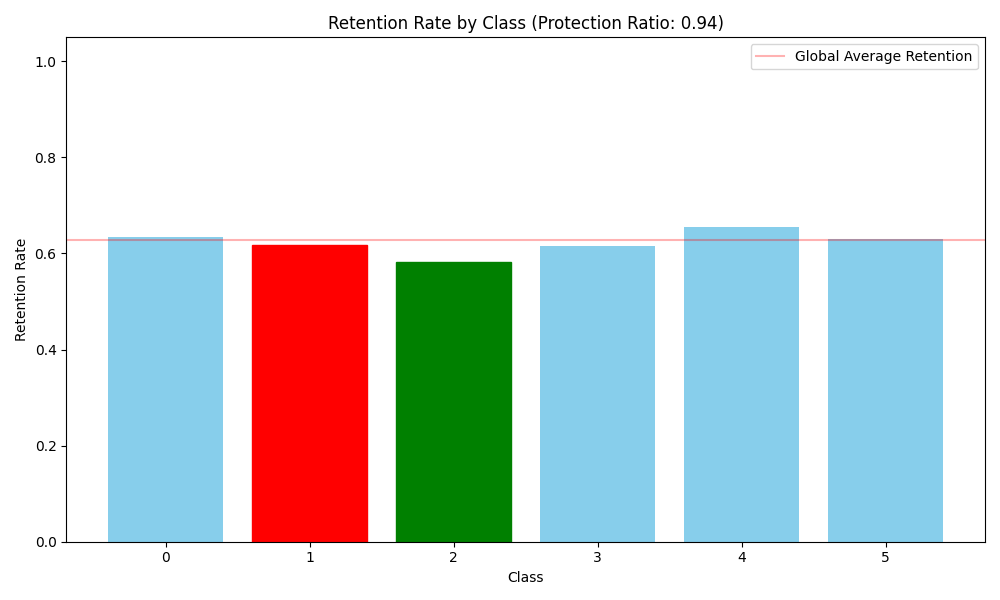
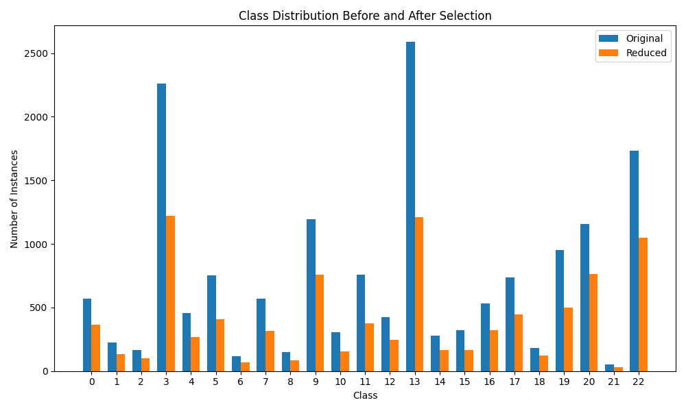
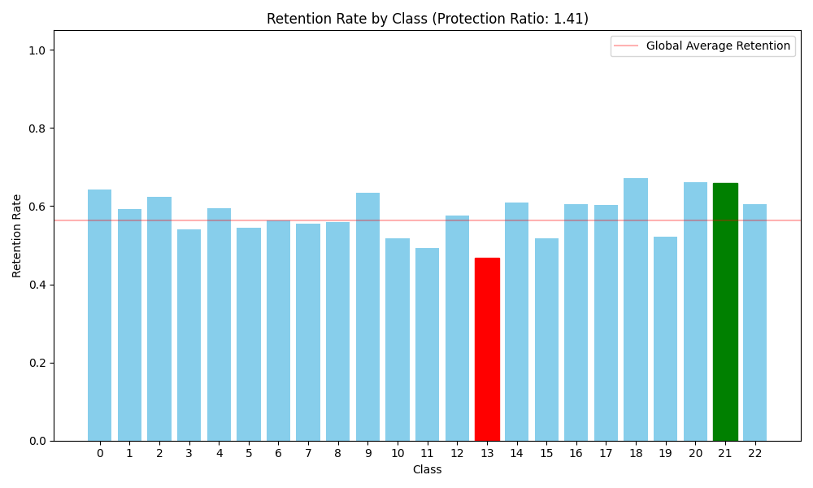

# EntropySublinearAEIS Evaluation Report: Clustering Strategies

Evaluation of SublinearAEIS using different clustering methods.

## Dataset: TREC | Clustering: DBSCAN
- **Total Reduction:** 37.23%
- **Minority Retention (Class 2):** 58.14% (50 / 86)
- **Majority Retention (Class 1):** 61.70% (746 / 1209)
- **Protection Ratio:** **0.9422** (Goal > 1.0)

## Dataset: OHSUMED | Clustering: DBSCAN
- **Total Reduction:** 43.68%
- **Minority Retention (Class 21):** 66.00% (33 / 50)
- **Majority Retention (Class 13):** 46.68% (1208 / 2588)
- **Protection Ratio:** **1.4140** (Goal > 1.0)

